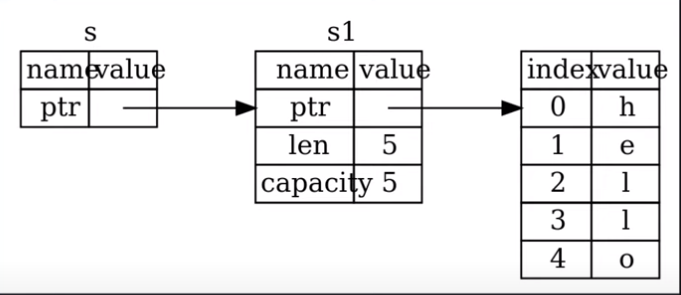

# Rust

## Syntax

- All variables are immutable by default. mut key word can be used to make a variable immutable.
- let is used to define a variable and const for constant.
- An immutable variable can be redefined using let to another data type and this is called shadowing.
- Rust allows you to add underscores _ to literal values, to improve readability.
- println!() is for printing and use {} inside “ ” to print a variable as
    
    ```rust
    println!("{} is your number", num);
    ```
    Note: This can only be used if num implements `Display` trait. If some type implements `Debug` trait instead, then we use something like this: 
    ```rust
    println!("{:?} is your number", num);
    ```
    
- // is used for single line comment and /*     */ for block comment.
- In rust, syntax for calling a method via an object or via a pointer to an object, in both cases dot operator is used. (Rust has automatic referencing and deferencing)

    Note: Rust provides a default implementation for `Deref` trait which resolves the call via references. And if we implement our type we can also implement our `Deref` implementation for that type.

- Checkout this for naming convention - https://rust-lang.github.io/api-guidelines/naming.html

## Data Types

Primitives

- Signed Integer (i32, i64, i128)
- Unsigned Integer (u32, u64, u128)
- Floating point (f32, f64)
- Boolean (bool)
- Character (char)

Non Primitives

- Tuples (”Hello”, 5)
    - To access values either deconstruct and assign
    
    ```rust
    let (a,b) = datatuple;
    ```
    
    - Or use dot operator
    - 
    
    ```rust
    let a = datatuple.0;
    ```
    
- Array [1,2,3,4,5]

## Functions

- fn keyword can be used to define functions.
- As a naming convention, all function names are in lower case and use underscore for space.
- To specify a return type - > can be used after the parameter list.
- Functions can either return by using a return statement, or they can return implicitly by just putting the variable(or return value) in the last line. We omit the semicolon for last expression(or value)

## Control Flow

- if statement’s conditions doesn’t require paranthesis.
- If we put a number (or some expression not resulting in boolean) inside if condition then it will result in an error unlike javascript.
- We can have if else statements assigned to a let variable, to initialize it just as in the case of a ternary operator.
- loop keyword can be used to run an indefinite loop until a break statement is encountered.
- We can also have a loop statement assigned to a let variable and the let variable can be given whatever value is present after the break (here break is used like return keyword)
- There is also while loop and for loop available in rust.

## Ownership Model of Rust

|  | Pros | Cons |
| --- | --- | --- |
| Garbage collection | Error free | No control over memory |
|  | Faster write time | Slower and unpredictable runtime performance |
|  |  | Larger program size |
|  |  |  |
| Manual memory management | Control over memory | Error prone |
|  | Faster runtime | Slower write time |
|  | Smaller program size |  |
|  |  |  |
| Ownership model | Control over memory | Slower write time. Learning curve (fighting with the borrow checker) |
|  | Error free |  |
|  | Faster runtime |  |
|  | Smaller program size |  |

### Stack and Heap

Note:-

1. Pushing data to stack is faster than allocating storage to data on heap as heap has to search for empty space.
2. Accessing data from stack is faster than accessing data from heap, as in heap you’ll have to follow the pointers where as usually data is directly accessible in stack (especially the primitive datatypes).
3. Non primitive data types’ pointer is stored on stack, whenever we want to store them in stack.

### Ownership Rules

1. Each value in rust has a variable that’s called its owner.
2. There can only be one owner at a time.
3. When the owner goes out of scope, the value will be dropped.

When we copy a primitive datatype variable, a new copy is created Eg

```rust
let x: i32 = 5;
let y: i32 = x; //A new Copy is created
```

When we copy a non-primitive datatype variable, it neither does create a copy nor does it points to the same memory in heap(like in Java), btw this is called a shallow copy. Instead, it moves the data from first variable to the new variable and invalidates the first variable.

```rust
let s1: String = String::from("hello");
let s2: String = s1; //Move(not shallow copy)

println!("{}, world!", s1);
/* This will result in an error,
because s1 is invalidated and its data is moved */

//this creates a new copy in heap
let s3: String = s2.clone(); 
```

Note:- 
1. Passing a non primitive datatype variable to a function as parameter also moves the data and invalidates the original variable.
2. There are two traits, `Copy` and `Clone`. Copy is implicit meaning you don't have to call any method. Types get copied by simply bitwise copy. But the Clone is explicit, we can overload it by implementing the `Clone` trait. We cannot implement `Copy` traits for types that implement drop traits. For example `Vec`.

```jsx
fn main() {
	let s: String = String::from("hello");
	takes_ownership(s);

	let x: i32 = 5;
	makes_copy(x);
	println!("{}",x);
}

fn takes_ownership(some_string: String) {
	println!("{}", some_string);
}

fn makes_copy(some_integer: i32) {
	println!("{}", some_integer);
}
```

3rd line of main gives error, whereas last line of main runs without any error.

```rust
fn main() {
    let sl: String = gives_ownership();
    println!("sl = {}", sl);
}

fn gives_ownership() -> String {
    let some_string: String = String::from("hello");
    some_string
}
```

When gives_ownership() returns some_string, the ownership of somestring gets transfered as well and it can be used in main as s1.

```jsx
fn main() {
    let sl: String = gives_ownership();
    let s2: String = String::from("hello");
    let s3: String = takes_and_gives_back(s2);
    println!("sl = {}, s3 = {}", sl, s3);
}

fn gives_ownership() -> String {
    let some_string: String = String::from("hello");

    some_string
}

fn takes_and_gives_back(a_string: String) -> String {
    a_string
}
```

takes_and_gives_back() first takes ownership from main function’s s2 and then returns the ownership to s3

### Problem with transfering ownership

```rust
fn main() {
    let sl: String = String::from("hello");
    let (s2, len) = calculate_length(sl);
    println!("The length of '{}' is {}.", s2, len);
}

fn calculate_length(s: String) -> (String, usize) {
    let length: usize = s.len(); // len() returns the length of a String
    (s, length)
}
```

Here you can see due to transfer of ownership we have to return a tuple for creating a simple length calculating function.

But references are a better solution to fix this problem.

### References

```rust
fn main() {
    let sl: String = String::from("hello");
    let len: usize = calculate_length(&sl);
    println!("The length of '{}' is {}.", sl, len);
}

fn calculate_length(s: &String) -> usize {
    let length: usize = s.len(); // len() returns the length of a String
    length
}
```

This is how we solve the above mentioned problem using a reference instead.



S is a reference which points to s1 and s1 in turn points to a memory location in heap.

Note:- 

1. References don’t take ownership of the underlying value.
2. References are immutable by default.
3. In order to have a mutable reference we use mut keyword for the original variable (ie s1 in the given example) and also add mut keyword to the reference (ie s in the given example) 

```rust
fn main() {
    let mut sl: String = String::from("hello");
    change(&mut sl);
}

fn change(some_string: &mut String) {
    some_string.push_str(", world");
}
```

Limitation of mutable reference:

- You can have only one mutable reference to a piece of data in a particular scope.

```rust
fn main() {
    let mut s: String = String::from("hello");

    let rl: &mut String = &mut s;
    let r2: &mut String = &mut s; 
/*cannot borrow s as mutable more than once at a time.
Second mutable borrow occurs here */

    println!("{}, {}", rl, r2);
}
```

- You cant have a mutable reference to a piece of data if an immutable reference to it already exists.

```rust
fn main() {
    let mut s: String = String::from("hello");

    let rl: &String = &s;
    let r2: &String = &s;

		let r3: &mut String = &mut s; 
/* cannot borrow s as mutable because it is also borrowed as immutable */

    println!("{}, {}, {}", rl, r2, r3);
}
```

Note:- You can have multiple immutable references to a piece of data.

Note:- Scope of a reference starts at where it is first introduced and ends where it is last used.

```rust
fn main() {
    let mut s: String = String::from("hello");

    let rl: &String = &s;
    let r2: &String = &s;

    println!("{}, {}", rl, r2);

    let r3: &mut String = &mut s;
    println!("{}", r3);
}
```

This means this is possible.

```rust
fn main() {
    let reference_to_nothing: &String = dangle();
}

fn dangle() -> &String {
    let s: String = String::from("hello");
    &s
}
```

Rust prevents us from getting a dangling reference(reference to an invalid memory). Here s is defined within the scope of dangle() and when its reference is pased to main, its ownership is not and by then the s is deallocated the memory. Hence rust gives an error to prevent this memory safety issue.

### Slices

Slices let you reference a contiguous sequence of elements within a collection instead of referencing the entire collection. Slices don’t take ownership just like references. 

```rust
fn main() {
    let mut s: String = String::from("hello world");
    let hello: &str = &s[0..5];
    let world: &str = &s[6..11];
    let word: usize = first_word(&s);
    s.clear();
}

fn first_word(s: &String) -> usize {
    let bytes: &[u8] = s.as_bytes();

    for (i, &item) in bytes.iter().enumerate() {
        if item == b' ' {
            return i;
        }
    }

    s.len()
}
```


Here hello is a slice of string, it points to starting half and world is another slice pointing to the other half starting from index 6.

### Structs

- Structs, short for structures, allow you to create complex data types in Rust.
- Structs are used to encapsulate related properties and behaviors into a single entity.
- Structs in Rust are similar to structs in C, but with additional features such as methods.

```rust
struct User {
    username: String,
    email: String,
    sign_in_count: u64,
    active: bool,
}

```

- In the above example, `User` is a struct type with four fields: `username`, `email`, `sign_in_count`, and `active`.
- Each field has a specified type, and all instances of this struct will have these fields with the corresponding values.

```rust
let mut user1: User = User {
    email: String::from("someone@example.com"),
    username: String::from("someusername123"),
    active: true,
    sign_in_count: 1,
};

```

- To use the struct, you can create an instance of it like the `user1` variable above. Here, `user1` is an instance of `User`.
- Structs can also have methods, functions that are associated with an instance of a struct. You define methods with the `impl` keyword.

```rust
impl User {
    fn show_email(&self) {
        println!("Email: {}", self.email);
    }
}

```

- In the above example, `show_email` is a method that takes a reference to an instance of `User` and prints its `email` field.
- Methods can be called on an instance of the struct with the dot operator, like `user1.show_email()`.

### Enums

- Enums, short for enumerations, allow you to define a type by enumerating its possible values.
- In Rust, Enums are created using the **`enum`** keyword.

```rust
enum Color {
    Red,
    Green,
    Blue,
}
```

- Enums can also contain data:

```rust
enum IpAddress {
    V4(u8, u8, u8, u8),
    V6(String),
}
```

- Enums can have methods associated with them, providing a way to encapsulate behavior.
- Unwrapping Enums: Enums in Rust can be unwrapped to access the underlying value. This is particularly useful when you're working with the `Option` enum. The `unwrap` method can be used to access the value inside an enum variant, but be aware that it will cause the program to panic if the variant is `None`. It's often safer to use methods like `unwrap_or` and `unwrap_or_else`, which allow you to specify default values in the case of a `None` variant.

### Closures

- Closures in Rust are anonymous functions you can save in a variable or pass as arguments to other functions.
- Closures are defined using a set of pipes (`||`), optional input variables, an arrow (`>`), and the block of code.
- They are often used as input to functions that take a function as an argument, also known as higher-order functions.
- Unlike functions, closures can capture values from the scope in which they're defined.
- Here is an example of a closure:
    
    ```rust
    let plus_one = |x| x + 1;
    let a = 5;
    println!("{}", plus_one(a)); // prints 6
    
    ```
    
- In this example, `plus_one` is a closure that takes one parameter `x` and adds one to it.
- Closures can capture outer variables. For example:
    
    ```rust
    let num = 5;
    let plus_num = |x| x + num;
    println!("{}", plus_num(10)); // prints 15
    
    ```
    
- Here, `plus_num` captures the `num` variable from its environment.
- Closures can capture variables from their environment in three ways: taking ownership with the `move` keyword, borrowing immutably, and borrowing mutably. This is called the FnOnce, Fn, and FnMut traits respectively.
- The type of capture (FnOnce, Fn, FnMut) depends on how the closure uses the variables.
- Rust infers which trait to use based on how the closure uses the captured variables.

### Generics

- Generics are abstract stand-ins for concrete types or other properties.
- Generics are often used in function signatures when we want the function to accept arguments of any type.
- Here is an example of a function that uses generics:
    
    ```rust
    fn foo<T>(arg: T) {
        // do something with arg
    }
    
    ```
    
- In this example, `T` is the generic type. When we call the function, `T` will be replaced with a concrete type.
- Generics can also be used in struct and enum definitions.
- Here is an example of a struct that uses generics:
    
    ```rust
    struct Point<T> {
        x: T,
        y: T,
    }
    
    ```
    
- In this example, `Point` is a struct that can be used with any type `T`.
- Generics can be used to define complex types, such as a type that can hold either an integer or a float, or a type that can hold a value of any type.
- Generics are checked at compile time, so they do not incur any runtime overhead.

### Traits

- Traits are a way to group method signatures together to define a set of behaviors necessary for a certain purpose.
- In Rust, a trait is defined with the `trait` keyword followed by its name and a set of methods defined inside curly brackets.
- For example, a `Printable` trait might look like this:

```rust
trait Printable {
    fn format(&self) -> String;
}

```

- This `Printable` trait has one method, `format`, that takes a read-only reference to self and returns a `String`.
- Any type that implements this trait must provide an implementation for this `format` method.
- To implement a trait for a particular type, we use the `impl` keyword followed by the trait name for the type name, and then provide implementations for the trait's methods inside curly brackets.
- For example, to implement `Printable` for a `Document` type, we might write:

```rust
struct Document {
    title: String,
    body: String,
}

impl Printable for Document {
    fn format(&self) -> String {
        format!("Title: {}, Body: {}", self.title, self.body)
    }
}

```

- Now, any `Document` instance can call the `format` method defined in the `Printable` trait.
- Traits can also have default implementations for some or all of their methods. If a type implements that trait, it will get all of the default implementations that it doesn't override.
- Trait bounds can be used to specify that a generic type must implement a particular trait. For example, the following function `print` takes an argument `item` that must implement the `Printable` trait:

```rust
fn print<T: Printable>(item: T) {
    println!("{}", item.format());
}

```

- This function can now print any type that implements `Printable`.

## Concurrency in Rust

### Threads

- Rust's standard library provides a library for threads, which allow parallel execution of code.
- To create a new thread, we call the `thread::spawn` function and pass it a closure containing the code we want to run in the new thread.
- The `spawn` function returns a `JoinHandle`. A `JoinHandle` is an owned value that, when we call the `join` method on it, will wait for its thread to finish.

```rust
use std::thread;

fn main() {
    let handle = thread::spawn(|| {
        // thread code here
    });

    // some code here

    handle.join().unwrap();
}

```

- In the above example, a new thread is spawned that executes the code inside the closure.
- The main thread continues and executes the "some code here" part.
- Finally, `handle.join()` is called, which blocks the main thread until the new thread finishes executing.

**Joining Threads**

- When a program ends, all its threads are terminated, regardless of whether they have finished executing.
- To let a thread finish before the main thread ends, we can use the `join` method on the `JoinHandle`.
- The `join` method returns a `Result` that indicates whether the thread has panicked.
- If the call to `join` returns `Ok`, the child thread did not panic. If it returns `Err`, the child thread has panicked.

```rust
use std::thread;

fn main() {
    let handle = thread::spawn(|| {
        // thread code here
    });

    match handle.join() {
        Ok(_) => println!("Thread finished successfully."),
        Err(_) => println!("Thread panicked."),
    }
}

```

- In the above example, the main thread will wait for the spawned thread to finish and then print a message depending on whether the thread has panicked or not.

### Channels

- Channels in Rust are a way of sending data between threads.
- The `std::sync::mpsc` module provides two types for working with channels: `Sender` and `Receiver`. The `Sender` type is used to send data, and the `Receiver` type is used to receive data.
- To create a new channel, we use the `mpsc::channel` function. This function returns a tuple with a sender and a receiver.
- The `Sender::send` method is used to send data. If the receiving end has disconnected, this method will return an error.
- The `Receiver::recv` method is used to receive data. This method blocks the current thread until a message is received or the sending end disconnects. If the sending end has disconnected without sending any data, this method will return an error.
- Here is an example of using a channel:

```rust
use std::sync::mpsc;
use std::thread;

fn main() {
    let (tx, rx) = mpsc::channel();

    thread::spawn(move || {
        let val = String::from("hi");
        tx.send(val).unwrap();
    });

    let received = rx.recv().unwrap();
    println!("Got: {}", received);
}

```

- In this example, a new channel is created. The transmitting end is moved into a new thread, which sends the string "hi" through the channel. The main thread waits for a message to be received and then prints it.

### Mutex

- Mutex stands for "mutual exclusion". It is a synchronisation primitive that is used to protect shared data from being simultaneously accessed by multiple threads.
- In Rust, mutexes are safe to use thanks to the ownership and type systems.
- The Mutex type in Rust's standard library follows the interior mutability pattern. It allows you to mutate the data it guards, even when the Mutex itself is immutable.
- Mutexes have a lock method that returns a smart pointer called MutexGuard, wrapped in a LockResult that you need to handle. This smart pointer implements Deref to point to our inner data.
- The smart pointer also has a Drop implementation that releases the lock automatically when a MutexGuard goes out of scope. This allows us to not worry about forgetting to release the lock.
- Mutex does implement the `Send` and `Sync` trait, which is why it can be shared across threads.
- Attempting to create a deadlock by having the same thread acquire the lock more than once will result in a runtime panic.

- Note:-
    - Mutex uses internal mutability.
    - RC smart pointers don’t work inside threads, instead use Arc Smart Pointers for passing to threads

## Async/Await in Rust

In Rust async/await are keywords used to write special functions, closures, and blocks that can their pause execution and yield control back to the runtime allowing other code to make progress, and then pick back up from where they left off. Typically those pauses are to wait for IO.

```rust
fn my_function() -> impl Future<Output = ()> {
	println!("I'm an async function!");
}
```

```rust
async fn my_function() {
    println!("I'm an async function!");
}
```

The second function is basically concise form for the first function.

### Future Trait

It is a simple state machine, which can be polled to check the status/state.
So, whenever we create a future, it basically means that we are creating some type that implements future trait( like state machine )which stores the data from different chunks of the async code block.  Any code inside the future is divided into different chunks for cooperative scheduling.
Future is similar to Promise in Javascript.

```rust
trait Future {
    type Output;
    fn poll(&mut self, wake: fn()) -> Poll<Self::Output>;
}

// 0 implementations
enum Poll<T> {
    Ready(T),
    Pending,
}
```

The poll function also expects a callback function (named wake)

If calling the poll function returns pending, then the future will continue making progress until its ready to get polled again. When its ready to get polled again, the future will call the wake callback, to notify its executor.

```rust
async fn my_function() {
    println!("I'm an async function!");

    let s1: String = read_from_database().await;
    println!("First result: {}", s1);

    let s2: String = read_from_database().await;
    println!("Second result: {}", s2);
}

async fn read_from_database() -> String {
    "DB Result".to_owned()
}
```

Adding await to the async function, attempts to run the future to completion, whereas if there was no await attached then the async function would have simply returned a future telling the state.

Note:- 

- await keyword can only be used inside an async function.
- main function can't be made async, it needs a runtime/executor, so we generally use runtime.
- The **`await`** keyword is used inside **`async`** functions to suspend the execution of the function until the awaited value (which should be a **`Future`**) is ready. This allows the asynchronous function to yield control back to the event loop, allowing other tasks to run in the meantime.